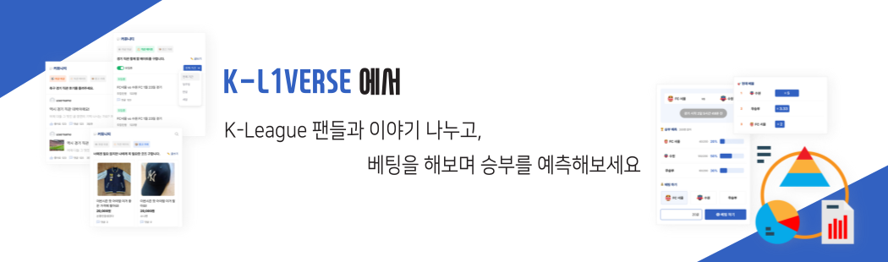
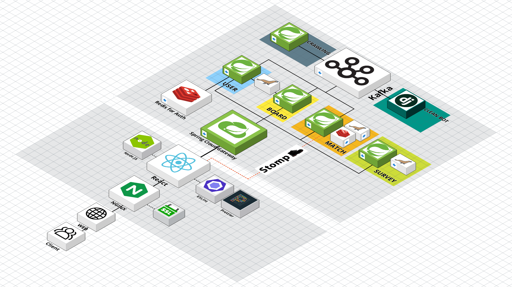

# K리그 팬덤 SNS, K-L1VERSE

<!-- 이부분도 우리 메인 배너 넣기 -->




- 배포 URL : https://K-L1VERSE.site
- Test ID & PW : 소셜로그인 시스템으로 테스트 계정 X

<br>

## 프로젝트 소개

### [K-league 1 팬덤 SNS]

- 유저끼리 직관 후기, 직관 메이트, 중고 거래 등 간단한 피드 공유
- 성향검사로 응원할 팀 추천하고 이를 sns에 공유
- 팀 정보(응원가, 엠블럼, 선수단 등) 소개
- 경기 일정 정보 제공
- 서비스 내 포인트 배팅
- 실시간 경기 상황 타임라인
- 실시간 채팅 - 클린봇에 의한 욕설 및 혐오발언 필터링

<br>

## 팀원 소개

<div align="center">

|                                                   **홍윤기**                                                    |                                                     **고수림**                                                     |                                                    **고해림**                                                     |
| :-------------------------------------------------------------------------------------------------------------: | :----------------------------------------------------------------------------------------------------------------: | :---------------------------------------------------------------------------------------------------------------: |
| [](https://github.com/Yg-Hong) | [](https://github.com/sulim0314) | [](https://github.com/haelim12) |
|                                 [윤기의 개발 회고](./assets/개발회고_홍윤기.md)                                 |                                  [수림의 개발 회고](./assets/개발회고_고수림.md)                                   |                                  [해림의 개발 회고](./assets/개발회고_고해림.md)                                  |

<br>

|                                                     **김동훈**                                                      |                                                   **엄소현**                                                   |                                                       **전성재**                                                       |
| :-----------------------------------------------------------------------------------------------------------------: | :------------------------------------------------------------------------------------------------------------: | :--------------------------------------------------------------------------------------------------------------------: |
| [](https://github.com/huni19541) | [](https://github.com/sohy19) | [](https://github.com/jeonseongjae98) |
|                                   [동훈의 개발 회고](./assets/개발회고_김동훈.md)                                   |                                [소현의 개발 회고](./assets/개발회고_엄소현.md)                                 |                                    [성재의 개발 회고](./assets/개발회고_전성재.md)                                     |

</div>

<br>

## 프로젝트의 특장점(기능 관점)

1. 실시간 경기 채팅방, 실시간 경기 정보 제공
2. 포인트 시스템(출석, 게시글 작성, 댓글 작성 / 배팅, 호감팀 뱃지 구매)으로 유저에게 직접적인 참여 독려
3. 성향 test의 결과를 SNS를 통해 공유 (유저 유입)
4. 케이리그 관련 피드 게시판/ 직관 메이트 구인 게시판/ 중고거래 게시판 + 비밀댓글
5. 해시태그를 통한 게시글 추천 
6. 기존의 공격적인 워딩의 축구 커뮤니티에서 벗어나 클린 게시판, 클린 채팅방 지향
7. 뱃지 아이템 구매 및 착용
8. 알림을 통한 관심 구단의 뉴스, 포인트, 댓글 확인 기능

## 프로젝트의 차별점/독창성(기술 관점)

1. Jenkins 파이프라인을 통한 CI/CD 자동화
2. 도메인 주도 설계 MSA
3. API Gateway pattern을 이용한 검증 및 라우팅
4. Kafka를 이용한 SAGA 분산 트랜잭션 패턴 적용
5. web socket을 이용한 실시간 채팅, 알림 서비스
6. 오픈소스 NLP를 이용한 혐오표현 자동 필터링
7. 실시간 크롤링
8. Redis를 이용한 인증/인가, 출석체크
9. Redis를 이용한 채팅방 백업 구축
10. 실시간성을 최대한 보장하기 위해 Kafka를 이용한 비동기식 클린봇 기능

## 개발 환경

"프론트엔드 :
React 18.2.0,
Node.js 20.10.0,
Nginx 1.18.0 (Ubuntu)

백엔드 :
SpringBoot 3.2.1(Gradle, Java 17),
Spring Cloud Gateway,
Spring Data JPA,
Spring Security,
Django(DRF),
Kafka

DB :
MariaDB
redis

CI/CD :
Jenkins

Infra :
Docker"

- Front : React 18.2.0(styled-components, Recoil, ESLint, Prettier), Node.js 20.10.0, Nginx 1.18.0 (Ubuntu)
  <br><br>
- Back-end : SpringBoot 3.2.1(Gradle, Java 17), Spring Cloud Gateway, Spring Data JPA, Spring Security, Django(DRF), Kafka
  <br><br>
- CI/CD : Jenkins, Docker
  <br><br>
- 버전 및 이슈관리 : Gitlab, Jira
  <br><br>
- 협업 툴 : Discord, MatterMost, [Notion](https://sohy.notion.site/A409-Project-K-L1VERSE-9799a742de2743f2a5728d7ddea838b4?pvs=4)
  <br><br>
- 서비스 배포 환경 : AWS
  <br><br>

## 프로젝트 구조

<div align="center">

| [](https://lab.ssafy.com/s10-webmobile2-sub2/S10P12A409/-/blob/master/assets/%EC%8B%9C%EC%8A%A4%ED%85%9C_%EC%95%84%ED%82%A4%ED%85%8D%EC%B2%98_%EC%B5%9C%EC%A2%85%EB%B3%B8.png) |
| :---------------------------------------------------------------------------------------------------------------------------------------------------------------------------------------------------------------------------: |

</div>

### Backend

<details>
<summary>Board Project</summary>
<div markdown="1">

```
│  .gitignore
│  build.gradle
│  Dockerfile
│  gradlew
│  gradlew.bat
│  settings.gradle
│
├─gradle
│  └─wrapper
│          gradle-wrapper.jar
│          gradle-wrapper.properties
│
└─src
    ├─main
    │  ├─java
    │  │  └─com
    │  │      └─KL1verse
    │  │          │  BoardApplication.java
    │  │          │
    │  │          ├─Board
    │  │          │  ├─controller
    │  │          │  │      BoardController.java
    │  │          │  │
    │  │          │  ├─dto
    │  │          │  │  └─req
    │  │          │  │          BoardDTO.java
    │  │          │  │          SearchBoardConditionDto.java
    │  │          │  │
    │  │          │  ├─exception
    │  │          │  │      BoardException.java
    │  │          │  │      UnauthorizedException.java
    │  │          │  │
    │  │          │  ├─repository
    │  │          │  │  │  BoardRepository.java
    │  │          │  │  │
    │  │          │  │  └─entity
    │  │          │  │          Board.java
    │  │          │  │
    │  │          │  └─service
    │  │          │          BoardService.java
    │  │          │          BoardServiceImpl.java
    │  │          │
    │  │          ├─Comment
    │  │          │  ├─controller
    │  │          │  │      CommentController.java
    │  │          │  │
    │  │          │  ├─dto
    │  │          │  │  └─req
    │  │          │  │          CommentDTO.java
    │  │          │  │          CommentLikeDTO.java
    │  │          │  │
    │  │          │  ├─repository
    │  │          │  │  │  CommentLikeRepository.java
    │  │          │  │  │  CommentRepository.java
    │  │          │  │  │
    │  │          │  │  └─entity
    │  │          │  │          Comment.java
    │  │          │  │          CommentLike.java
    │  │          │  │
    │  │          │  └─service
    │  │          │          CommentLikeService.java
    │  │          │          CommentLikeServiceImpl.java
    │  │          │          CommentService.java
    │  │          │          CommentServiceImpl.java
    │  │          │
    │  │          ├─kafka
    │  │          │  │  KafkaConfig.java
    │  │          │  │  KafkaProducer.java
    │  │          │  │
    │  │          │  ├─consumer
    │  │          │  │      CleanbotBoardOutputConsumer.java
    │  │          │  │
    │  │          │  ├─dto
    │  │          │  │  ├─req
    │  │          │  │  │      BoardCleanbotCheckReqDto.java
    │  │          │  │  │
    │  │          │  │  └─res
    │  │          │  │          BoardNotificationResDto.java
    │  │          │  │          CleanbotCheckResDto.java
    │  │          │  │
    │  │          │  └─producer
    │  │          │          KafkaBoardCleanbotProducer.java
    │  │          │          KafkaBoardNotificationProducer.java
    │  │          │
    │  │          ├─Mate
    │  │          │  ├─controller
    │  │          │  │      MateController.java
    │  │          │  │
    │  │          │  ├─dto
    │  │          │  │  └─req
    │  │          │  │          MateDTO.java
    │  │          │  │
    │  │          │  ├─exception
    │  │          │  │      BoardException.java
    │  │          │  │
    │  │          │  ├─repository
    │  │          │  │  │  MateRepository.java
    │  │          │  │  │
    │  │          │  │  └─entity
    │  │          │  │          Mate.java
    │  │          │  │
    │  │          │  └─service
    │  │          │          MateService.java
    │  │          │          MateServiceImpl.java
    │  │          │
    │  │          ├─Product
    │  │          │  ├─controller
    │  │          │  │      ProductController.java
    │  │          │  │
    │  │          │  ├─dto
    │  │          │  │  └─req
    │  │          │  │          ProductDTO.java
    │  │          │  │
    │  │          │  ├─exception
    │  │          │  │      BoardException.java
    │  │          │  │
    │  │          │  ├─repository
    │  │          │  │  │  ProductRepository.java
    │  │          │  │  │
    │  │          │  │  └─entity
    │  │          │  │          Product.java
    │  │          │  │
    │  │          │  └─service
    │  │          │          ProductService.java
    │  │          │          ProductServiceImpl.java
    │  │          │
    │  │          ├─s3
    │  │          │  ├─config
    │  │          │  │      S3Config.java
    │  │          │  │
    │  │          │  ├─controller
    │  │          │  │      S3Controller.java
    │  │          │  │
    │  │          │  ├─dto
    │  │          │  │  └─res
    │  │          │  │          S3ResDto.java
    │  │          │  │
    │  │          │  ├─repository
    │  │          │  │  │  BoardImageRepository.java
    │  │          │  │  │  FileRepository.java
    │  │          │  │  │
    │  │          │  │  └─entity
    │  │          │  │          BoardImage.java
    │  │          │  │          File.java
    │  │          │  │
    │  │          │  └─service
    │  │          │          BoardImageService.java
    │  │          │          FileService.java
    │  │          │          S3Service.java
    │  │          │          S3ServiceImpl.java
    │  │          │
    │  │          └─Waggle
    │  │              ├─controller
    │  │              │      WaggleController.java
    │  │              │      WaggleLikeController.java
    │  │              │
    │  │              ├─dto
    │  │              │  └─req
    │  │              │          WaggleDTO.java
    │  │              │          WaggleLikeDTO.java
    │  │              │
    │  │              ├─exception
    │  │              │      BoardException.java
    │  │              │
    │  │              ├─repository
    │  │              │  │  WaggleLikeRepository.java
    │  │              │  │  WaggleRepository.java
    │  │              │  │  WaggleUserHashTagRepository.java
    │  │              │  │
    │  │              │  └─entity
    │  │              │          Waggle.java
    │  │              │          WaggleLike.java
    │  │              │          WaggleUserHashTag.java
    │  │              │
    │  │              └─service
    │  │                      WaggleLikeService.java
    │  │                      WaggleLikeServiceImpl.java
    │  │                      WaggleService.java
    │  │                      WaggleServiceImpl.java
    │  │
    │  └─resources
    │          application-deploy.yml
    │          application-dev.yml
    │          application.yml
    │
    └─test
        └─java
            └─com
                └─KL1verse
                    └─Board
                            BoardApplicationTests.java
```

</div>
</details>

<details>
<summary> Cleanbot Project</summary>
<div markdown="1">

```
│  .gitignore
│  db.sqlite3
│  Dockerfile
│  manage.py
│  requirements.txt
│
├─.idea
│  │  .gitignore
│  │  Cleanbot.iml
│  │  misc.xml
│  │  modules.xml
│  │  vcs.xml
│  │
│  └─inspectionProfiles
│          profiles_settings.xml
│
├─bot
│  │  admin.py
│  │  apps.py
│  │  models.py
│  │  serializers.py
│  │  tests.py
│  │  urls.py
│  │  views.py
│  │  __init__.py
│  │
│  └─migrations
│          __init__.py
│
└─Cleanbot
        asgi.py
        settings.py
        urls.py
        wsgi.py
        __init__.py


```

</div>
</details>

<details>
<summary>Crawl Project</summary>
<div markdown="1">

```
│  .gitignore
│  build.gradle
│  Dockerfile
│  gradlew
│  gradlew.bat
│  settings.gradle
│
├─gradle
│  └─wrapper
│          gradle-wrapper.jar
│          gradle-wrapper.properties
│
└─src
    ├─main
    │  ├─java
    │  │  └─com
    │  │      └─KL1verse
    │  │          └─Crawl
    │  │              │  CrawlApplication.java
    │  │              │
    │  │              ├─domain
    │  │              │  ├─kafka
    │  │              │  │  │  KafkaConfig.java
    │  │              │  │  │
    │  │              │  │  └─producer
    │  │              │  │          KafkaNewsNotificationProducer.java
    │  │              │  │          KafkaProducer.java
    │  │              │  │
    │  │              │  ├─news
    │  │              │  │  ├─dto
    │  │              │  │  │  └─res
    │  │              │  │  │          NewsResDto.java
    │  │              │  │  │
    │  │              │  │  └─service
    │  │              │  │          NewsCrawl.java
    │  │              │  │
    │  │              │  └─openai
    │  │              │      └─service
    │  │              │              OpenAiService.java
    │  │              │
    │  │              └─global
    │  │                      RandomUserAgent.java
    │  │
    │  └─resources
    │          application-deploy.yml
    │          application-dev.yml
    │          application.yml
    │
    └─test
        └─java
            └─com
                └─KL1verse
                    └─Crawl
                            CrawlApplicationTests.java
```

</div>
</details>

<details>
<summary>Gateway Project</summary>
<div markdown="1">

```
│  .gitignore
│  build.gradle
│  Dockerfile
│  gradlew
│  gradlew.bat
│  settings.gradle
│
├─gradle
│  └─wrapper
│          gradle-wrapper.jar
│          gradle-wrapper.properties
│
└─src
    ├─main
    │  ├─java
    │  │  └─com
    │  │      └─KL1verse
    │  │          └─Gateway
    │  │              │  GatewayApplication.java
    │  │              │
    │  │              └─auth
    │  │                  │  JWTFilter.java
    │  │                  │  JwtUtil.java
    │  │                  │
    │  │                  ├─config
    │  │                  │      CorsConfig.java
    │  │                  │      SecurityConfig.java
    │  │                  │
    │  │                  └─dto
    │  │                      └─res
    │  │                              AccessTokenResDto.java
    │  │
    │  └─resources
    │          application-deploy.yml
    │          application-dev.yml
    │          application.yml
    │
    └─test
        └─java
            └─com
                └─KL1verse
                    └─Gateway
                            GatewayApplicationTests.java
```

</div>
</details>

<details>
<summary>Match Project</summary>
<div markdown="1">

```
│  .gitignore
│  build.gradle
│  Dockerfile
│  gradlew
│  gradlew.bat
│
├─gradle
│  └─wrapper
│          gradle-wrapper.jar
│          gradle-wrapper.properties
│
└─src
    └─main
        ├─java
        │  └─com
        │      └─KL1verse
        │          └─match
        │              │  MatchApplication.java
        │              │
        │              ├─betting
        │              │  ├─controller
        │              │  │      BettingController.java
        │              │  │
        │              │  ├─dto
        │              │  │  │  Winner.java
        │              │  │  │
        │              │  │  └─req
        │              │  │          BettingRequest.java
        │              │  │
        │              │  ├─repository
        │              │  │  │  BettingRepository.java
        │              │  │  │
        │              │  │  └─entity
        │              │  │          Betting.java
        │              │  │
        │              │  └─service
        │              │          BettingService.java
        │              │          BettingServiceImpl.java
        │              │
        │              ├─chat
        │              │  ├─config
        │              │  │      ChatConfig.java
        │              │  │
        │              │  ├─controller
        │              │  │      MessageController.java
        │              │  │
        │              │  └─dto
        │              │      ├─req
        │              │      │      MessageReqDto.java
        │              │      │
        │              │      └─res
        │              │              MessageResDto.java
        │              │
        │              ├─domain
        │              │  └─sample
        │              │      ├─controller
        │              │      │      SampleController.java
        │              │      │
        │              │      └─exception
        │              │              SampleException.java
        │              │
        │              ├─global
        │              │  │  ResponseCode.java
        │              │  │
        │              │  ├─config
        │              │  │      CorsConfig.java
        │              │  │
        │              │  ├─dto
        │              │  │      BaseResponse.java
        │              │  │
        │              │  └─exception
        │              │          BaseException.java
        │              │          GlobalExceptionHandler.java
        │              │
        │              ├─kafka
        │              │  │  KafkaConfig.java
        │              │  │  KafkaProducer.java
        │              │  │
        │              │  ├─consumer
        │              │  │      KafkaBettingRollbackConsumer.java
        │              │  │      KafkaCleanbotResultConsumer.java
        │              │  │
        │              │  ├─dto
        │              │  │  ├─req
        │              │  │  │      CleanbotCheckReqDto.java
        │              │  │  │
        │              │  │  └─res
        │              │  │          CleanbotCheckResDto.java
        │              │  │          MatchNotificationResDto.java
        │              │  │
        │              │  └─producer
        │              │          KafkaBettingProducer.java
        │              │          KafkaBettingWinProducer.java
        │              │          KafkaCleanbotCheckProducer.java
        │              │          KafkaMatchNotificationProducer.java
        │              │
        │              ├─match
        │              │  ├─controller
        │              │  │      MatchController.java
        │              │  │
        │              │  ├─dto
        │              │  │  ├─req
        │              │  │  │      MatchBettingRequest.java
        │              │  │  │      MatchDetailRequest.java
        │              │  │  │      MatchListRequest.java
        │              │  │  │      ScoreRequest.java
        │              │  │  │
        │              │  │  └─res
        │              │  │          MatchDetailResponse.java
        │              │  │          MatchListResponse.java
        │              │  │          TicketResponse.java
        │              │  │          TimelineResponse.java
        │              │  │
        │              │  ├─exception
        │              │  │      MatchException.java
        │              │  │
        │              │  ├─repository
        │              │  │  │  MatchRepository.java
        │              │  │  │  TimelineRepository.java
        │              │  │  │
        │              │  │  └─entity
        │              │  │          Match.java
        │              │  │          Timeline.java
        │              │  │
        │              │  └─service
        │              │          MatchService.java
        │              │          MatchServiceImpl.java
        │              │
        │              ├─scheduler
        │              │  ├─config
        │              │  │      SchedulingConfig.java
        │              │  │
        │              │  ├─controller
        │              │  │      SchedulerController.java
        │              │  │
        │              │  └─service
        │              │          SchedulerService.java
        │              │
        │              ├─team
        │              │  ├─controller
        │              │  │      TeamController.java
        │              │  │
        │              │  ├─dto
        │              │  │  ├─req
        │              │  │  │      TeamInfoRequest.java
        │              │  │  │
        │              │  │  └─res
        │              │  │          TeamInfoResponse.java
        │              │  │
        │              │  ├─exception
        │              │  │      TeamException.java
        │              │  │
        │              │  ├─repository
        │              │  │  │  MemberRepository.java
        │              │  │  │  TeamRepository.java
        │              │  │  │
        │              │  │  └─entity
        │              │  │          Member.java
        │              │  │          Song.java
        │              │  │          Team.java
        │              │  │
        │              │  └─service
        │              │          TeamService.java
        │              │          TeamServiceImpl.java
        │              │
        │              └─youtube
        │                  ├─controller
        │                  │      YoutubeController.java
        │                  │
        │                  ├─dto
        │                  │  ├─req
        │                  │  │      YoutubeRankRequest.java
        │                  │  │
        │                  │  └─res
        │                  │          YoutubeTimeResponse.java
        │                  │
        │                  ├─repository
        │                  │  │  YoutubeRepository.java
        │                  │  │
        │                  │  └─entity
        │                  │          Youtube.java
        │                  │
        │                  └─service
        │                          YoutubeService.java
        │                          YoutubeServiceImpl.java
        │
        └─resources
                application-deploy.yml
                application-dev.yml
                application.yml
```

</div>
</details>

<details>
<summary>Survey Project</summary>
<div markdown="1">

```
│  .gitignore
│  build.gradle
│  Dockerfile
│  gradlew
│  gradlew.bat
│  settings.gradle
│
├─gradle
│  └─wrapper
│          gradle-wrapper.jar
│          gradle-wrapper.properties
│
└─src
    ├─main
    │  ├─java
    │  │  └─com
    │  │      └─KL1verse
    │  │          └─Survey
    │  │              │  SurveyApplication.java
    │  │              │
    │  │              ├─domain
    │  │              │  └─sample
    │  │              │      ├─controller
    │  │              │      │      SampleController.java
    │  │              │      │
    │  │              │      └─exception
    │  │              │              SampleException.java
    │  │              │
    │  │              ├─global
    │  │              │  │  ResponseCode.java
    │  │              │  │
    │  │              │  ├─dto
    │  │              │  │      BaseResponse.java
    │  │              │  │
    │  │              │  └─exception
    │  │              │          BaseException.java
    │  │              │          GlobalExceptionHandler.java
    │  │              │
    │  │              └─survey
    │  │                  ├─controller
    │  │                  │      SurveyController.java
    │  │                  │
    │  │                  ├─dto
    │  │                  │  ├─req
    │  │                  │  │      AnswerDTO.java
    │  │                  │  │      QuestionDTO.java
    │  │                  │  │      SurveyDTO.java
    │  │                  │  │      UserSelectionDTO.java
    │  │                  │  │
    │  │                  │  └─res
    │  │                  │          SurveyResponse.java
    │  │                  │
    │  │                  ├─exception
    │  │                  │      SurveyException.java
    │  │                  │
    │  │                  ├─repository
    │  │                  │  │  AnswerRepository.java
    │  │                  │  │  QuestionRepository.java
    │  │                  │  │  SurveyRepository.java
    │  │                  │  │  WeightRepository.java
    │  │                  │  │
    │  │                  │  └─entity
    │  │                  │          Answer.java
    │  │                  │          Question.java
    │  │                  │          Survey.java
    │  │                  │          Team.java
    │  │                  │          Weight.java
    │  │                  │
    │  │                  └─service
    │  │                          AnswerService.java
    │  │                          AnswerServiceImpl.java
    │  │                          QuestionService.java
    │  │                          QuestionServiceImpl.java
    │  │                          SurveyService.java
    │  │                          SurveyServiceImpl.java
    │  │
    │  └─resources
    │          application-deploy.yml
    │          application-dev.yml
    │          application.yml
    │
    └─test
        └─java
            └─com
                └─KL1verse
                    └─Survey
                            SurveyApplicationTests.java

```

</div>
</details>

<details>
<summary>UserServer Project</summary>
<div markdown="1">

```
│  .gitignore
│  build.gradle
│  Dockerfile
│  gradlew
│  gradlew.bat
│  settings.gradle
│
├─gradle
│  └─wrapper
│          gradle-wrapper.jar
│          gradle-wrapper.properties
│
└─src
    ├─main
    │  ├─java
    │  │  └─com
    │  │      └─kl1verse
    │  │          └─UserServer
    │  │              │  UserServerApplication.java
    │  │              │
    │  │              ├─domain
    │  │              │  ├─auth
    │  │              │  │  │  JwtFilter.java
    │  │              │  │  │  JwtProperty.java
    │  │              │  │  │  JwtSecurityConfig.java
    │  │              │  │  │  JwtUtil.java
    │  │              │  │  │
    │  │              │  │  ├─controller
    │  │              │  │  │      AuthController.java
    │  │              │  │  │
    │  │              │  │  ├─dto
    │  │              │  │  │  ├─req
    │  │              │  │  │  │      SignInReqDto.java
    │  │              │  │  │  │      SignUpReqDto.java
    │  │              │  │  │  │
    │  │              │  │  │  └─res
    │  │              │  │  │          ReIssueResDto.java
    │  │              │  │  │          SignInResDto.java
    │  │              │  │  │
    │  │              │  │  ├─exception
    │  │              │  │  │      TokenException.java
    │  │              │  │  │
    │  │              │  │  ├─repository
    │  │              │  │  │  │  TokenRepository.java
    │  │              │  │  │  │
    │  │              │  │  │  └─entity
    │  │              │  │  │          Token.java
    │  │              │  │  │
    │  │              │  │  └─service
    │  │              │  │          AuthService.java
    │  │              │  │
    │  │              │  ├─badge
    │  │              │  │  ├─controller
    │  │              │  │  │      BadgeController.java
    │  │              │  │  │
    │  │              │  │  ├─dto
    │  │              │  │  │  └─req
    │  │              │  │  │          BadgeBuyReqDto.java
    │  │              │  │  │          BadgeDetailReqDto.java
    │  │              │  │  │
    │  │              │  │  ├─exception
    │  │              │  │  │      BadgeException.java
    │  │              │  │  │
    │  │              │  │  ├─repository
    │  │              │  │  │  │  BadgeDetailRepository.java
    │  │              │  │  │  │  BadgeRepository.java
    │  │              │  │  │  │
    │  │              │  │  │  └─entity
    │  │              │  │  │          Badge.java
    │  │              │  │  │          BadgeDetail.java
    │  │              │  │  │
    │  │              │  │  └─service
    │  │              │  │          BadgeService.java
    │  │              │  │
    │  │              │  ├─betting
    │  │              │  │      BettingEntity.java
    │  │              │  │      Winner.java
    │  │              │  │
    │  │              │  ├─chat
    │  │              │  │  ├─config
    │  │              │  │  │      ChatConfig.java
    │  │              │  │  │
    │  │              │  │  ├─controller
    │  │              │  │  │      ChatMessageController.java
    │  │              │  │  │
    │  │              │  │  └─dto
    │  │              │  │      └─req
    │  │              │  │              MessageReqDto.java
    │  │              │  │
    │  │              │  ├─kafka
    │  │              │  │  │  KafkaConfig.java
    │  │              │  │  │  KafkaUserRepository.java
    │  │              │  │  │
    │  │              │  │  ├─consumer
    │  │              │  │  │      KafkaBettingWinConsumer.java
    │  │              │  │  │      KafkaBoardNotificationConsumer.java
    │  │              │  │  │      KafkaMatchNotificationConsumer.java
    │  │              │  │  │      KafkaNewsNotificationConsumer.java
    │  │              │  │  │      KafkaUserConsumer.java
    │  │              │  │  │
    │  │              │  │  ├─dto
    │  │              │  │  │  └─req
    │  │              │  │  │          BoardNotificationReqDto.java
    │  │              │  │  │          NewsNotificationListReqDto.java
    │  │              │  │  │          NotificationListReqDto.java
    │  │              │  │  │
    │  │              │  │  └─producer
    │  │              │  │          KafkaBettingRollbackProducer.java
    │  │              │  │          KafkaProducer.java
    │  │              │  │
    │  │              │  ├─notification
    │  │              │  │  ├─config
    │  │              │  │  │      NotificationConfig.java
    │  │              │  │  │
    │  │              │  │  ├─controller
    │  │              │  │  │      MessageController.java
    │  │              │  │  │
    │  │              │  │  ├─dto
    │  │              │  │  │  ├─req
    │  │              │  │  │  │      MessageReqDto.java
    │  │              │  │  │  │
    │  │              │  │  │  └─res
    │  │              │  │  │          NotificationResDto.java
    │  │              │  │  │
    │  │              │  │  ├─repository
    │  │              │  │  │  │  NotificationRepository.java
    │  │              │  │  │  │
    │  │              │  │  │  └─entity
    │  │              │  │  │          Notification.java
    │  │              │  │  │          NotificationTypeConverter.java
    │  │              │  │  │
    │  │              │  │  └─service
    │  │              │  │          NotificationService.java
    │  │              │  │
    │  │              │  ├─oauth
    │  │              │  │  ├─controller
    │  │              │  │  │      OAuthController.java
    │  │              │  │  │
    │  │              │  │  └─service
    │  │              │  │          OAuthService.java
    │  │              │  │          OAuthServiceImpl.java
    │  │              │  │
    │  │              │  ├─s3
    │  │              │  │  ├─config
    │  │              │  │  │      S3Config.java
    │  │              │  │  │
    │  │              │  │  ├─controller
    │  │              │  │  │      S3Controller.java
    │  │              │  │  │
    │  │              │  │  ├─dto
    │  │              │  │  │  └─res
    │  │              │  │  │          S3ResDto.java
    │  │              │  │  │
    │  │              │  │  ├─repository
    │  │              │  │  │  │  FileRepository.java
    │  │              │  │  │  │  UserImageRepository.java
    │  │              │  │  │  │
    │  │              │  │  │  └─entity
    │  │              │  │  │          File.java
    │  │              │  │  │          UserImage.java
    │  │              │  │  │
    │  │              │  │  └─service
    │  │              │  │          FileService.java
    │  │              │  │          S3Service.java
    │  │              │  │          S3ServiceImpl.java
    │  │              │  │          UserImageService.java
    │  │              │  │
    │  │              │  ├─sample
    │  │              │  │  ├─controller
    │  │              │  │  │      SampleController.java
    │  │              │  │  │
    │  │              │  │  └─exception
    │  │              │  │          SampleException.java
    │  │              │  │
    │  │              │  └─user
    │  │              │      ├─controller
    │  │              │      │      NostradamusController.java
    │  │              │      │      UserController.java
    │  │              │      │
    │  │              │      ├─dto
    │  │              │      │  └─res
    │  │              │      │          MypageResponseDto.java
    │  │              │      │          NicknameUpdateReqDto.java
    │  │              │      │          NostradamusResponse.java
    │  │              │      │
    │  │              │      ├─exception
    │  │              │      │      UserException.java
    │  │              │      │
    │  │              │      ├─repository
    │  │              │      │  │  NostradamusRepository.java
    │  │              │      │  │  UserRepository.java
    │  │              │      │  │
    │  │              │      │  └─entity
    │  │              │      │          User.java
    │  │              │      │
    │  │              │      └─service
    │  │              │              MypageServiceImpl.java
    │  │              │              NostradamusServiceImpl.java
    │  │              │              UserDetailServiceImpl.java
    │  │              │              UserService.java
    │  │              │
    │  │              └─global
    │  │                  │  ResponseCode.java
    │  │                  │
    │  │                  ├─config
    │  │                  │      CorsConfig.java
    │  │                  │      SecurityConfig.java
    │  │                  │      WebConfig.java
    │  │                  │
    │  │                  ├─dto
    │  │                  │      BaseResponse.java
    │  │                  │
    │  │                  └─exception
    │  │                          BaseException.java
    │  │                          GlobalExceptionHandler.java
    │  │
    │  └─resources
    │          application-deploy.yml
    │          application-dev.yml
    │          application.yml
    │
    └─test
        └─java
            └─com
                └─kl1verse
                    └─UserServer
                            UserServerApplicationTests.java


```

</div>
</details>

### Frontend

<details>
<summary>Frontend Project</summary>
<div markdown="1">

```
│  .eslintrc.js
│  .gitignore
│  .prettierrc.js
│  Dockerfile
│  package-lock.json
│  package.json
│  README.md
│
├─.idea
│  │  .gitignore
│  │  frontend.iml
│  │  misc.xml
│  │  modules.xml
│  │  vcs.xml
│  │
│  └─inspectionProfiles
│          Project_Default.xml
│
├─conf
│      nginx.conf
│
├─public
│  │  favicon.ico
│  │  index.html
│  │  manifest.json
│  │  robots.txt
│  │
│  ├─badge
│  │      badge0.png
│  │      badge0back.png
│  │      badge1.png
│  │      .
│  │      .
│  │      .
│  │
│  └─images
│      └─surveyResult
│              background1.png
│              background2.png
│              background3.png
│              .
│              .
│              .
│
└─src
    │  App.js
    │  App.test.js
    │  comment.svg
    │  index.js
    │  reportWebVitals.js
    │  setupTests.js
    │
    ├─api
    │      authAxios.js
    │      axios.js
    │      betting.js
    │      comment.js
    │      match.js
    │      mate.js
    │      mockAxios.js
    │      nostradamus.js
    │      product.js
    │      request.js
    │      survey.js
    │      team.js
    │      waggle.js
    │      youtube.js
    │
    ├─assets
    │  │  BadgeBackground.svg
    │  │  BadgeBackground2.svg
    │  │  badges.png
    │  │  .
    │  │  .
    │  │  .
    │  │
    │  ├─banners
    │  │      banner1.png
    │  │      banner2.png
    │  │
    │  ├─fonts
    │  │      font.css
    │  │
    │  ├─icon
    │  │      back-icon.png
    │  │      bell-icon.png
    │  │      calendar-icon.svg
    │  │      .
    │  │      .
    │  │      .
    │  │
    │  └─login_button
    │          betting.png
    │          community.png
    │          google-icon.png
    │          kakao.png
    │          naver-icon.png
    │
    ├─components
    │  │  Nav.js
    │  │
    │  ├─board
    │  │  │  BoardFile.jsx
    │  │  │  BoardTopNavBar.jsx
    │  │  │  CommentContainer.jsx
    │  │  │  CommentForm.jsx
    │  │  │  CommentItemCard.jsx
    │  │  │  CommentList.jsx
    │  │  │  CommentReplyCard.jsx
    │  │  │  dateFormat.jsx
    │  │  │  ImageBox.jsx
    │  │  │  Like.jsx
    │  │  │  MateContainer.jsx
    │  │  │  MateItemCard.jsx
    │  │  │  MateRegistCard.jsx
    │  │  │  ProductContainer.jsx
    │  │  │  ProductItemCard.jsx
    │  │  │  ProductRegistCard.jsx
    │  │  │  SearchComponent.jsx
    │  │  │  TimeForBoard.jsx
    │  │  │  WaggleContainer.jsx
    │  │  │  WaggleItemCard.jsx
    │  │  │  WaggleRegistCard.jsx
    │  │  │
    │  │  └─toggle
    │  │          ScheduleModal.jsx
    │  │          ScheduleSelect2.jsx
    │  │          ScheduleTable2.jsx
    │  │
    │  ├─common
    │  │      Modal.jsx
    │  │      Radio.jsx
    │  │      RadioGroup.jsx
    │  │
    │  ├─login
    │  │      GoogleLoginButton.jsx
    │  │      KakaoLoginButton.jsx
    │  │      LoginLogo.jsx
    │  │      NaverLoginButton.jsx
    │  │
    │  ├─logout
    │  │      LogoutButton.jsx
    │  │
    │  ├─main
    │  │      Banner.jsx
    │  │      Board.jsx
    │  │      BoardItem.jsx
    │  │      Footer.jsx
    │  │      Hotclip.jsx
    │  │      Nostradamus.jsx
    │  │      Notice.jsx
    │  │      Survey.jsx
    │  │      TodayMatch.jsx
    │  │      TodayMatchItem.jsx
    │  │
    │  ├─match
    │  │  │  BettingContainer.jsx
    │  │  │  BettingPercentItem.jsx
    │  │  │  Chat.jsx
    │  │  │  Chat_origin.jsx
    │  │  │  EventItem.jsx
    │  │  │  MatchScheduleTop.jsx
    │  │  │  ScheduleList.jsx
    │  │  │  ScheduleSelect.jsx
    │  │  │  ScheduleTable.jsx
    │  │  │  ScoreItem.jsx
    │  │  │  Time.jsx
    │  │  │  TimelineContainer.jsx
    │  │  │
    │  │  ├─currentBetting
    │  │  │      CurrentBettingComponent.jsx
    │  │  │      CurrentBettingContainer.jsx
    │  │  │
    │  │  ├─detail
    │  │  │      MatchDetailScore.jsx
    │  │  │      MatchTimeComponent.jsx
    │  │  │
    │  │  ├─doBetting
    │  │  │      DoBettingContainer.jsx
    │  │  │
    │  │  └─prediction
    │  │          PredictionComponent.jsx
    │  │          PredictionContainer.jsx
    │  │          PreditionBar.jsx
    │  │
    │  ├─mypage
    │  │      BadgeButton.jsx
    │  │      EditNicknameModal.jsx
    │  │      LogoutButton.jsx
    │  │      MyWagle.jsx
    │  │      SettingItem.jsx
    │  │      Usergoal.jsx
    │  │      UserProfile.jsx
    │  │
    │  ├─notification
    │  │      NotificationCard.jsx
    │  │      NotificationList.jsx
    │  │
    │  ├─Survey
    │  │      LoadingBar.jsx
    │  │
    │  └─team
    │          TeamInfoItem.jsx
    │
    ├─global
    │      NotificationState.js
    │      SocketProvider.js
    │      UserState.js
    │
    ├─hooks
    │      useDebounce.js
    │      useUserAccessToken.js
    │
    ├─pages
    │  ├─board_page
    │  │  ├─mate_page
    │  │  │      MateDetailPage.jsx
    │  │  │      MateListPage.jsx
    │  │  │      MateRegistPage.jsx
    │  │  │
    │  │  ├─product_page
    │  │  │      ProductDetailPage.jsx
    │  │  │      ProductListPage.jsx
    │  │  │      ProductRegistPage.jsx
    │  │  │
    │  │  └─waggle_page
    │  │          WaggleDetailPage.jsx
    │  │          WaggleListPage.jsx
    │  │          WaggleRegistPage.jsx
    │  │
    │  ├─login_page
    │  │      GoogleRedirection.jsx
    │  │      KaKaoRedirection.jsx
    │  │      LoginPage.jsx
    │  │      NaverRedirection.jsx
    │  │
    │  ├─logout_page
    │  │      LogoutPage.jsx
    │  │
    │  ├─main_page
    │  │      MainPage.jsx
    │  │
    │  ├─match_page
    │  │      MatchChattingPage.jsx
    │  │      MatchDetailPage.jsx
    │  │      MatchSchedulePage.jsx
    │  │
    │  ├─my_page
    │  │      Badge.jsx
    │  │      BadgeComponent.jsx
    │  │      BadgeGroup.jsx
    │  │      BadgeList.jsx
    │  │      MyPage.jsx
    │  │      SettingPage.jsx
    │  │
    │  ├─nav
    │  │      Navbar.jsx
    │  │
    │  ├─notification_page
    │  │      NotifiationPage.jsx
    │  │
    │  ├─SurveyPage
    │  │      KakaoPage.jsx
    │  │      QuestionPage.jsx
    │  │      ResultPage.jsx
    │  │      StartPage.jsx
    │  │
    │  └─teamPage
    │          TeamInfoPage.jsx
    │
    └─styles
        │  Button.css
        │  common.css
        │
        ├─BoardStyles
        │      BoardCreateStyle.js
        │      BoardDetailStyle.js
        │      BoardStyle.js
        │      BoardTopNavbarStyle.js
        │      CommentStyle.js
        │      ImageStyle.js
        │      MateListStyle.js
        │      ProductListStyle.js
        │      WaggleListStyle.js
        │
        ├─global
        │      GlobalStyle.js
        │
        ├─main-styles
        │      BannerStyle.js
        │      BoardItemStyle.js
        │      HotclipStyle.js
        │      MainStyle.js
        │      NostradamusStyle.js
        │      NoticeStyle.js
        │      SurveyStyle.js
        │      TodayMatchStyle.js
        │
        ├─match-styles
        │  │  MatchChattingStyle.js
        │  │  MatchDetailStyle.js
        │  │  MatchScheduleStyle.js
        │  │  MatchTimelinStyle.js
        │  │
        │  ├─currentBetting
        │  │      CurrentBettingComponentStyles.js
        │  │      CurrentBettingContainerStyles.js
        │  │
        │  ├─detail
        │  │      MatchDetailScoreStyles.js
        │  │      MatchTimeComponentStyles.js
        │  │
        │  ├─doBetting
        │  │      DoBettingContainerStyles.js
        │  │
        │  └─prediction
        │          PredictionComponentStyles.js
        │          PredictionContainerStyles.js
        │          PreditionBarStyles.js
        │
        ├─mypage-styles
        │      badgeStyle.js
        │      EditNicknameModel.js
        │      MypageStyle.js
        │      SettingStyle.js
        │
        ├─navbar-styles
        │      NavbarStyle.js
        │
        ├─notification-styles
        │      NotificationStyle.js
        │
        ├─SurveyStyles
        │      LoadingBarStyle.js
        │      Main.js
        │      QuizCardStyle.js
        │      ResultCardStyle.js
        │      StartCardStyle.js
        │      SurveyFont.css
        │      SurveyTop.js
        │
        └─TeamStyles
                TeamStyle.js


```

</div>
</details>

<br>

## 개발 기간 및 작업 관리

### 개발 기간

- 전체 개발 기간 : 2024-01-02 ~ 2024-02-16
- 기획 : 2024-01-08 ~ 2024-01-10
- 1st sprint : 2024-01-08 ~ 2024-01-12
- 2nd sprint : 2024-01-15 ~ 2024-01-19
- 3th sprint : 2024-01-22 ~ 2024-01-26
- 4th sprint : 2024-01-29 ~ 2024-02-01
- 추석 비대위 조직 : 2024-02-01 ~ 2024-02-05
- 5th sprint : 2024-02-05 ~ 2024-02-09
- 6th sprint : 2024-02-12 ~ 2024-02-16

<br>

## 신경 쓴 부분

<!-- 이 부분에 각자 특화 개발 내용 작성!! -->

- [접근제한 설정](https://github.com/likelion-project-README/README/wiki/README-6.%EC%8B%A0%EA%B2%BD-%EC%93%B4-%EB%B6%80%EB%B6%84_%EC%A0%91%EA%B7%BC%EC%A0%9C%ED%95%9C-%EC%84%A4%EC%A0%95)

- [Recoil을 통한 상태관리 및 유지](https://github.com/likelion-project-README/README/wiki/README-6.%EC%8B%A0%EA%B2%BD-%EC%93%B4-%EB%B6%80%EB%B6%84_Recoil%EC%9D%84-%ED%86%B5%ED%95%9C-%EC%83%81%ED%83%9C%EA%B4%80%EB%A6%AC-%EB%B0%8F-%EC%9C%A0%EC%A7%80)

<br>

## **프로젝트 소개**

### [메인페이지]


### [소셜로그인]

- 카카오, 구글, 네이버 계정으로 소셜 로그인이 가능합니다.


### [마이페이지]

- 프로필 사진을 설정할 수 있습니다.
- K-League1 소속 구단의 엠블럼을 뱃지로서 구매하고 착용할 수 있습니다.
- 닉네임을 설정할 수 있습니다.
- 골(포인트), 베팅 현황, 적중률을 확인할 수 있습니다.
- 각 게시판에서 성한 글을 모아볼 수 있습니다.


### [설정 페이지]

- 알림을 키거나 끌 수 있습니다.
- 로그아웃할 수 있습니다.


### [알림]

- 게시판에 작성한 글에 댓글이 달리거나 좋아요가 눌렸을 때 알림을 받을 수 있습니다.
- 출석이나 베팅 성공 등으로 포인트를 받았을 때 관련 알림을 받을 수 있습니다.
- 벳지를 착용했을 때 해당 구단의 관련 뉴스가 필터링되어 추천됩니다.
- 베팅한 경기에 대하여 경기 시작 5분 전에 시작 안내를 받을 수 있습니다.


### [팀 정보]

- 각 구단의 공식 SNS와 홈페이지, 응원가, 선수 정보들을 제공하여 K-League1 소속 구단들의 정보를 한 눈에 모아 볼 수 있습니다.


### [성향 test를 통한 구단 추천]

- K리그를 잘 모르는 사람들을 대상으로 성향 테스트를 통해 사용자가 선택한 답변의 가중치를 분석해 가중치가 가장 높은 구단 1개를 추천합니다.
- 추천된 구단을 SNS를 통해 다른 사람들과 공유할 수 있습니다.


### [경기 일정]

- K-League1 경기 일정들을 리스트와 캘린더 형태로 확인할 수 있습니다.


### [경기 상세]

- 경기 진행 동안 실시간 스코어와 타임라인을 볼 수 있습니다.
- 경기 시작 10분 전까지 응원하는 팀 또는 승리가 예상되는 팀에 베팅을 할 수 있습니다.
- 유저들의 베팅 상황에 따라 배당률이 계산되어 노출됩니다.
- 경기가 끝난 후 베팅 결과에 따라 포인트가 배분됩니다.
- 실시간 채팅을 통해 다른 유저들과 소통할 수 있습니다.
- 욕설 또는 불쾌함을 유발할 수 있는 글귀에는 클린봇 기능을 통해 필터링됩니다.


### [와글 게시판]

- 내용에 해시태그를 넣으면 자동으로 해시태그로 인식되어 추후 게시글 추천에 사용됩니다.
- 게시글 추천 버튼을 누르면 개인화된 추천 게시글이 도출됩니다.
- 게시글과 댓글 삭제버튼을 클릭하면 모달로 확인창이 뜹니다.
- 제목, 내용, 여러장의 사진 등을 첨부할 수 있습니다.


### [직관메이트 게시판]

- 특정 경기를 클릭한 후 게시글을 작성하여 직관 메이트를 구할 수 있습니다.
- 모집중인 게시글에 모집이 완료되면 모집완료로 변경할 수 있습니다.
- 제목, 내용, 여러장의 사진 등을 첨부할 수 있습니다.
- 게시글과 댓글 삭제버튼을 클릭하면 모달로 확인창이 뜹니다.


### [중고거래 게시판]

- 제목, 내용, 여러장의 사진 등을 첨부할 수 있고 사진을 필수적으로 첨부해야 합니다.
- 게시글을 작성하면 거래가능이 뜨고 거래가 완료되면 거래완료로 변경할 수 있습니다.

    
### [좋아요와 비밀 댓글]

- 좋아요와 댓글 수는 실시간으로 상세 페이지에 반영됩니다.
- 비밀 댓글을 클릭하면 비밀 댓글이 작성됩니다.
- 비밀 댓글은 게시글 작성자와 댓글 작성자만 확인할 수 있습니다.

<br>

## [K-L1VERSE 앞으로의 계획

- 구글 플레이스토어와 원스토어에 서비스를 배포할 계획입니다.
- 24년 4월까지 신규 유저 2,000명과 유저 리텐션 30%를 목표로 삼았습니다.
- K리그의 흥행과 신규 유저가 목표치를 달성한다면 서비스를 확대할 계획입니다.
