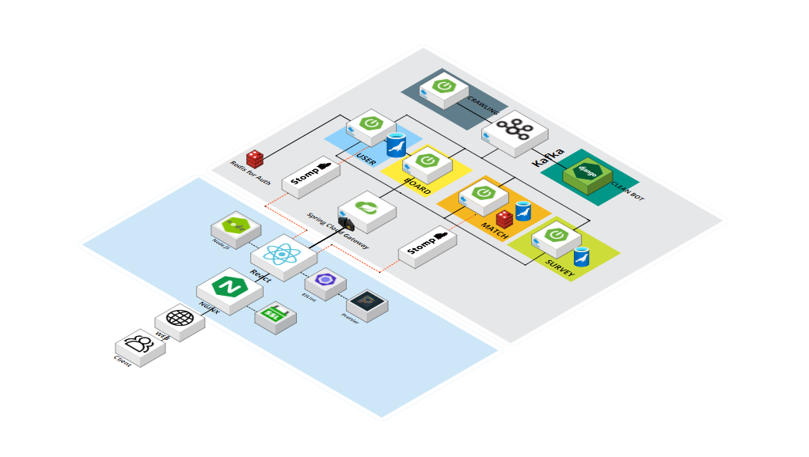

# K리그 팬덤 SNS, K-L1VERSE

<!-- 이부분도 우리 메인 배너 넣기 -->


- 배포 URL : https://K-L1VERSE.site
- Test ID & PW : 소셜로그인 시스템으로 테스트 계정 X

<br>

## 프로젝트 소개

### [K-league 1 팬덤 SNS]

- 유저끼리 직관 후기, 직관 메이트, 중고 거래 등 간단한 피드 공유
- 성향검사로 응원할 팀 추천하고 이를 sns에 공유
- 팀 정보(응원가, 엠블럼, 선수단 등) 소개
- 경기 일정 정보 제공
- 서비스 내 포인트 배팅
- 실시간 경기 상황 타임라인
- 실시간 채팅 - 클린봇에 의한 욕설 및 혐오발언 필터링

<br>

## 팀원 소개

<div align="center">

|                                                   **홍윤기**                                                    |                                                     **고수림**                                                     |                                                    **고해림**                                                     |
| :-------------------------------------------------------------------------------------------------------------: | :----------------------------------------------------------------------------------------------------------------: | :---------------------------------------------------------------------------------------------------------------: |
| [](https://github.com/Yg-Hong) | [](https://github.com/sulim0314) | [](https://github.com/haelim12) |
|                                 [윤기의 개발 회고](./assets/개발회고_홍윤기.md)                                 |                                  [수림의 개발 회고](./assets/개발회고_고수림.md)                                   |                                  [해림의 개발 회고](./assets/개발회고_고해림.md)                                  |

<br>

|                                                     **김동훈**                                                      |                                                   **엄소현**                                                   |                                                       **전성재**                                                       |
| :-----------------------------------------------------------------------------------------------------------------: | :------------------------------------------------------------------------------------------------------------: | :--------------------------------------------------------------------------------------------------------------------: |
| [](https://github.com/huni19541) | [](https://github.com/sohy19) | [](https://github.com/jeonseongjae98) |
|                                   [동훈의 개발 회고](./assets/개발회고_김동훈.md)                                   |                                [소현의 개발 회고](./assets/개발회고_엄소현.md)                                 |                                    [성재의 개발 회고](./assets/개발회고_전성재.md)                                     |

</div>

<br>

## 프로젝트의 특장점(기능 관점)

1. 실시간 경기 채팅방, 실시간 경기 정보 제공
2. 포인트 시스템(출석, 게시글 작성, 댓글 작성 / 배팅, 호감팀 뱃지 구매)으로 유저에게 직접적인 참여 독려
3. 성향 test의 결과를 SNS를 통해 공유 (유저 유입)
4. 케이리그 관련 피드 게시판/ 직관 메이트 구인 게시판/ 중고거래 게시판 + 비밀댓글
5. 해시태그를 통한 게시글 추천 
6. 기존의 공격적인 워딩의 축구 커뮤니티에서 벗어나 클린 게시판, 클린 채팅방 지향
7. 뱃지 아이템 구매 및 착용
8. 알림을 통한 관심 구단의 뉴스, 포인트, 댓글 확인 기능

## 프로젝트의 차별점/독창성(기술 관점)

1. Jenkins 파이프라인을 통한 CI/CD 자동화
2. 도메인 주도 설계 MSA
3. API Gateway pattern을 이용한 검증 및 라우팅
4. Kafka를 이용한 SAGA 분산 트랜잭션 패턴 적용
5. web socket을 이용한 실시간 채팅, 알림 서비스
6. 오픈소스 NLP를 이용한 혐오표현 자동 필터링
7. 실시간 크롤링
8. Redis를 이용한 인증/인가, 출석체크
9. Redis를 이용한 채팅방 백업 구축
10. 실시간성을 최대한 보장하기 위해 Kafka를 이용한 비동기식 클린봇 기능

## 개발 환경

"프론트엔드 :
React 18.2.0,
Node.js 20.10.0,
Nginx 1.18.0 (Ubuntu)

백엔드 :
SpringBoot 3.2.1(Gradle, Java 17),
Spring Cloud Gateway,
Spring Data JPA,
Spring Security,
Django(DRF),
Kafka

DB :
MariaDB
redis

CI/CD :
Jenkins

Infra :
Docker"

- Front : React 18.2.0(styled-components, Recoil, ESLint, Prettier), Node.js 20.10.0, Nginx 1.18.0 (Ubuntu)
  <br><br>
- Back-end : SpringBoot 3.2.1(Gradle, Java 17), Spring Cloud Gateway, Spring Data JPA, Spring Security, Django(DRF), Kafka
  <br><br>
- CI/CD : Jenkins, Docker
  <br><br>
- 버전 및 이슈관리 : Gitlab, Jira
  <br><br>
- 협업 툴 : Discord, MatterMost, [Notion](https://sohy.notion.site/A409-Project-K-L1VERSE-9799a742de2743f2a5728d7ddea838b4?pvs=4)
  <br><br>
- 서비스 배포 환경 : AWS
  <br><br>

## 프로젝트 구조

<div align="center">

| [](https://lab.ssafy.com/s10-webmobile2-sub2/S10P12A409/-/blob/master/assets/%EC%8B%9C%EC%8A%A4%ED%85%9C_%EC%95%84%ED%82%A4%ED%85%8D%EC%B2%98_%EC%B5%9C%EC%A2%85%EB%B3%B8.png) |
| :---------------------------------------------------------------------------------------------------------------------------------------------------------------------------------------------------------------------------: |

</div>

### Backend

<details>
<summary>Board Project</summary>
<div markdown="1">

```
│  .gitignore
│  build.gradle
│  Dockerfile
│  gradlew
│  gradlew.bat
│  settings.gradle
│
├─gradle
│  └─wrapper
│          gradle-wrapper.jar
│          gradle-wrapper.properties
│
└─src
    ├─main
    │  ├─java
    │  │  └─com
    │  │      └─KL1verse
    │  │          │  BoardApplication.java
    │  │          │
    │  │          ├─Board
    │  │          │  ├─controller
    │  │          │  │      BoardController.java
    │  │          │  │
    │  │          │  ├─dto
    │  │          │  │  └─req
    │  │          │  │          BoardDTO.java
    │  │          │  │          SearchBoardConditionDto.java
    │  │          │  │
    │  │          │  ├─exception
    │  │          │  │      BoardException.java
    │  │          │  │      UnauthorizedException.java
    │  │          │  │
    │  │          │  ├─repository
    │  │          │  │  │  BoardRepository.java
    │  │          │  │  │
    │  │          │  │  └─entity
    │  │          │  │          Board.java
    │  │          │  │
    │  │          │  └─service
    │  │          │          BoardService.java
    │  │          │          BoardServiceImpl.java
    │  │          │
    │  │          ├─Comment
    │  │          │  ├─controller
    │  │          │  │      CommentController.java
    │  │          │  │
    │  │          │  ├─dto
    │  │          │  │  └─req
    │  │          │  │          CommentDTO.java
    │  │          │  │          CommentLikeDTO.java
    │  │          │  │
    │  │          │  ├─repository
    │  │          │  │  │  CommentLikeRepository.java
    │  │          │  │  │  CommentRepository.java
    │  │          │  │  │
    │  │          │  │  └─entity
    │  │          │  │          Comment.java
    │  │          │  │          CommentLike.java
    │  │          │  │
    │  │          │  └─service
    │  │          │          CommentLikeService.java
    │  │          │          CommentLikeServiceImpl.java
    │  │          │          CommentService.java
    │  │          │          CommentServiceImpl.java
    │  │          │
    │  │          ├─kafka
    │  │          │  │  KafkaConfig.java
    │  │          │  │  KafkaProducer.java
    │  │          │  │
    │  │          │  ├─consumer
    │  │          │  │      CleanbotBoardOutputConsumer.java
    │  │          │  │
    │  │          │  ├─dto
    │  │          │  │  ├─req
    │  │          │  │  │      BoardCleanbotCheckReqDto.java
    │  │          │  │  │
    │  │          │  │  └─res
    │  │          │  │          BoardNotificationResDto.java
    │  │          │  │          CleanbotCheckResDto.java
    │  │          │  │
    │  │          │  └─producer
    │  │          │          KafkaBoardCleanbotProducer.java
    │  │          │          KafkaBoardNotificationProducer.java
    │  │          │
    │  │          ├─Mate
    │  │          │  ├─controller
    │  │          │  │      MateController.java
    │  │          │  │
    │  │          │  ├─dto
    │  │          │  │  └─req
    │  │          │  │          MateDTO.java
    │  │          │  │
    │  │          │  ├─exception
    │  │          │  │      BoardException.java
    │  │          │  │
    │  │          │  ├─repository
    │  │          │  │  │  MateRepository.java
    │  │          │  │  │
    │  │          │  │  └─entity
    │  │          │  │          Mate.java
    │  │          │  │
    │  │          │  └─service
    │  │          │          MateService.java
    │  │          │          MateServiceImpl.java
    │  │          │
    │  │          ├─Product
    │  │          │  ├─controller
    │  │          │  │      ProductController.java
    │  │          │  │
    │  │          │  ├─dto
    │  │          │  │  └─req
    │  │          │  │          ProductDTO.java
    │  │          │  │
    │  │          │  ├─exception
    │  │          │  │      BoardException.java
    │  │          │  │
    │  │          │  ├─repository
    │  │          │  │  │  ProductRepository.java
    │  │          │  │  │
    │  │          │  │  └─entity
    │  │          │  │          Product.java
    │  │          │  │
    │  │          │  └─service
    │  │          │          ProductService.java
    │  │          │          ProductServiceImpl.java
    │  │          │
    │  │          ├─s3
    │  │          │  ├─config
    │  │          │  │      S3Config.java
    │  │          │  │
    │  │          │  ├─controller
    │  │          │  │      S3Controller.java
    │  │          │  │
    │  │          │  ├─dto
    │  │          │  │  └─res
    │  │          │  │          S3ResDto.java
    │  │          │  │
    │  │          │  ├─repository
    │  │          │  │  │  BoardImageRepository.java
    │  │          │  │  │  FileRepository.java
    │  │          │  │  │
    │  │          │  │  └─entity
    │  │          │  │          BoardImage.java
    │  │          │  │          File.java
    │  │          │  │
    │  │          │  └─service
    │  │          │          BoardImageService.java
    │  │          │          FileService.java
    │  │          │          S3Service.java
    │  │          │          S3ServiceImpl.java
    │  │          │
    │  │          └─Waggle
    │  │              ├─controller
    │  │              │      WaggleController.java
    │  │              │      WaggleLikeController.java
    │  │              │
    │  │              ├─dto
    │  │              │  └─req
    │  │              │          WaggleDTO.java
    │  │              │          WaggleLikeDTO.java
    │  │              │
    │  │              ├─exception
    │  │              │      BoardException.java
    │  │              │
    │  │              ├─repository
    │  │              │  │  WaggleLikeRepository.java
    │  │              │  │  WaggleRepository.java
    │  │              │  │  WaggleUserHashTagRepository.java
    │  │              │  │
    │  │              │  └─entity
    │  │              │          Waggle.java
    │  │              │          WaggleLike.java
    │  │              │          WaggleUserHashTag.java
    │  │              │
    │  │              └─service
    │  │                      WaggleLikeService.java
    │  │                      WaggleLikeServiceImpl.java
    │  │                      WaggleService.java
    │  │                      WaggleServiceImpl.java
    │  │
    │  └─resources
    │          application-deploy.yml
    │          application-dev.yml
    │          application.yml
    │
    └─test
        └─java
            └─com
                └─KL1verse
                    └─Board
                            BoardApplicationTests.java
```

</div>
</details>

<details>
<summary> Cleanbot Project</summary>
<div markdown="1">

```
│  .gitignore
│  db.sqlite3
│  Dockerfile
│  manage.py
│  requirements.txt
│
├─.idea
│  │  .gitignore
│  │  Cleanbot.iml
│  │  misc.xml
│  │  modules.xml
│  │  vcs.xml
│  │
│  └─inspectionProfiles
│          profiles_settings.xml
│
├─bot
│  │  admin.py
│  │  apps.py
│  │  models.py
│  │  serializers.py
│  │  tests.py
│  │  urls.py
│  │  views.py
│  │  __init__.py
│  │
│  └─migrations
│          __init__.py
│
└─Cleanbot
        asgi.py
        settings.py
        urls.py
        wsgi.py
        __init__.py


```

</div>
</details>

<details>
<summary>Crawl Project</summary>
<div markdown="1">

```
│  .gitignore
│  build.gradle
│  Dockerfile
│  gradlew
│  gradlew.bat
│  settings.gradle
│
├─gradle
│  └─wrapper
│          gradle-wrapper.jar
│          gradle-wrapper.properties
│
└─src
    ├─main
    │  ├─java
    │  │  └─com
    │  │      └─KL1verse
    │  │          └─Crawl
    │  │              │  CrawlApplication.java
    │  │              │
    │  │              ├─domain
    │  │              │  ├─kafka
    │  │              │  │  │  KafkaConfig.java
    │  │              │  │  │
    │  │              │  │  └─producer
    │  │              │  │          KafkaNewsNotificationProducer.java
    │  │              │  │          KafkaProducer.java
    │  │              │  │
    │  │              │  ├─news
    │  │              │  │  ├─dto
    │  │              │  │  │  └─res
    │  │              │  │  │          NewsResDto.java
    │  │              │  │  │
    │  │              │  │  └─service
    │  │              │  │          NewsCrawl.java
    │  │              │  │
    │  │              │  └─openai
    │  │              │      └─service
    │  │              │              OpenAiService.java
    │  │              │
    │  │              └─global
    │  │                      RandomUserAgent.java
    │  │
    │  └─resources
    │          application-deploy.yml
    │          application-dev.yml
    │          application.yml
    │
    └─test
        └─java
            └─com
                └─KL1verse
                    └─Crawl
                            CrawlApplicationTests.java
```

</div>
</details>

<details>
<summary>Gateway Project</summary>
<div markdown="1">

```
│  .gitignore
│  build.gradle
│  Dockerfile
│  gradlew
│  gradlew.bat
│  settings.gradle
│
├─gradle
│  └─wrapper
│          gradle-wrapper.jar
│          gradle-wrapper.properties
│
└─src
    ├─main
    │  ├─java
    │  │  └─com
    │  │      └─KL1verse
    │  │          └─Gateway
    │  │              │  GatewayApplication.java
    │  │              │
    │  │              └─auth
    │  │                  │  JWTFilter.java
    │  │                  │  JwtUtil.java
    │  │                  │
    │  │                  ├─config
    │  │                  │      CorsConfig.java
    │  │                  │      SecurityConfig.java
    │  │                  │
    │  │                  └─dto
    │  │                      └─res
    │  │                              AccessTokenResDto.java
    │  │
    │  └─resources
    │          application-deploy.yml
    │          application-dev.yml
    │          application.yml
    │
    └─test
        └─java
            └─com
                └─KL1verse
                    └─Gateway
                            GatewayApplicationTests.java
```

</div>
</details>

<details>
<summary>Match Project</summary>
<div markdown="1">

```
│  .gitignore
│  build.gradle
│  Dockerfile
│  gradlew
│  gradlew.bat
│
├─gradle
│  └─wrapper
│          gradle-wrapper.jar
│          gradle-wrapper.properties
│
└─src
    └─main
        ├─java
        │  └─com
        │      └─KL1verse
        │          └─match
        │              │  MatchApplication.java
        │              │
        │              ├─betting
        │              │  ├─controller
        │              │  │      BettingController.java
        │              │  │
        │              │  ├─dto
        │              │  │  │  Winner.java
        │              │  │  │
        │              │  │  └─req
        │              │  │          BettingRequest.java
        │              │  │
        │              │  ├─repository
        │              │  │  │  BettingRepository.java
        │              │  │  │
        │              │  │  └─entity
        │              │  │          Betting.java
        │              │  │
        │              │  └─service
        │              │          BettingService.java
        │              │          BettingServiceImpl.java
        │              │
        │              ├─chat
        │              │  ├─config
        │              │  │      ChatConfig.java
        │              │  │
        │              │  ├─controller
        │              │  │      MessageController.java
        │              │  │
        │              │  └─dto
        │              │      ├─req
        │              │      │      MessageReqDto.java
        │              │      │
        │              │      └─res
        │              │              MessageResDto.java
        │              │
        │              ├─domain
        │              │  └─sample
        │              │      ├─controller
        │              │      │      SampleController.java
        │              │      │
        │              │      └─exception
        │              │              SampleException.java
        │              │
        │              ├─global
        │              │  │  ResponseCode.java
        │              │  │
        │              │  ├─config
        │              │  │      CorsConfig.java
        │              │  │
        │              │  ├─dto
        │              │  │      BaseResponse.java
        │              │  │
        │              │  └─exception
        │              │          BaseException.java
        │              │          GlobalExceptionHandler.java
        │              │
        │              ├─kafka
        │              │  │  KafkaConfig.java
        │              │  │  KafkaProducer.java
        │              │  │
        │              │  ├─consumer
        │              │  │      KafkaBettingRollbackConsumer.java
        │              │  │      KafkaCleanbotResultConsumer.java
        │              │  │
        │              │  ├─dto
        │              │  │  ├─req
        │              │  │  │      CleanbotCheckReqDto.java
        │              │  │  │
        │              │  │  └─res
        │              │  │          CleanbotCheckResDto.java
        │              │  │          MatchNotificationResDto.java
        │              │  │
        │              │  └─producer
        │              │          KafkaBettingProducer.java
        │              │          KafkaBettingWinProducer.java
        │              │          KafkaCleanbotCheckProducer.java
        │              │          KafkaMatchNotificationProducer.java
        │              │
        │              ├─match
        │              │  ├─controller
        │              │  │      MatchController.java
        │              │  │
        │              │  ├─dto
        │              │  │  ├─req
        │              │  │  │      MatchBettingRequest.java
        │              │  │  │      MatchDetailRequest.java
        │              │  │  │      MatchListRequest.java
        │              │  │  │      ScoreRequest.java
        │              │  │  │
        │              │  │  └─res
        │              │  │          MatchDetailResponse.java
        │              │  │          MatchListResponse.java
        │              │  │          TicketResponse.java
        │              │  │          TimelineResponse.java
        │              │  │
        │              │  ├─exception
        │              │  │      MatchException.java
        │              │  │
        │              │  ├─repository
        │              │  │  │  MatchRepository.java
        │              │  │  │  TimelineRepository.java
        │              │  │  │
        │              │  │  └─entity
        │              │  │          Match.java
        │              │  │          Timeline.java
        │              │  │
        │              │  └─service
        │              │          MatchService.java
        │              │          MatchServiceImpl.java
        │              │
        │              ├─scheduler
        │              │  ├─config
        │              │  │      SchedulingConfig.java
        │              │  │
        │              │  ├─controller
        │              │  │      SchedulerController.java
        │              │  │
        │              │  └─service
        │              │          SchedulerService.java
        │              │
        │              ├─team
        │              │  ├─controller
        │              │  │      TeamController.java
        │              │  │
        │              │  ├─dto
        │              │  │  ├─req
        │              │  │  │      TeamInfoRequest.java
        │              │  │  │
        │              │  │  └─res
        │              │  │          TeamInfoResponse.java
        │              │  │
        │              │  ├─exception
        │              │  │      TeamException.java
        │              │  │
        │              │  ├─repository
        │              │  │  │  MemberRepository.java
        │              │  │  │  TeamRepository.java
        │              │  │  │
        │              │  │  └─entity
        │              │  │          Member.java
        │              │  │          Song.java
        │              │  │          Team.java
        │              │  │
        │              │  └─service
        │              │          TeamService.java
        │              │          TeamServiceImpl.java
        │              │
        │              └─youtube
        │                  ├─controller
        │                  │      YoutubeController.java
        │                  │
        │                  ├─dto
        │                  │  ├─req
        │                  │  │      YoutubeRankRequest.java
        │                  │  │
        │                  │  └─res
        │                  │          YoutubeTimeResponse.java
        │                  │
        │                  ├─repository
        │                  │  │  YoutubeRepository.java
        │                  │  │
        │                  │  └─entity
        │                  │          Youtube.java
        │                  │
        │                  └─service
        │                          YoutubeService.java
        │                          YoutubeServiceImpl.java
        │
        └─resources
                application-deploy.yml
                application-dev.yml
                application.yml
```

</div>
</details>

<details>
<summary>Survey Project</summary>
<div markdown="1">

```
│  .gitignore
│  build.gradle
│  Dockerfile
│  gradlew
│  gradlew.bat
│  settings.gradle
│
├─gradle
│  └─wrapper
│          gradle-wrapper.jar
│          gradle-wrapper.properties
│
└─src
    ├─main
    │  ├─java
    │  │  └─com
    │  │      └─KL1verse
    │  │          └─Survey
    │  │              │  SurveyApplication.java
    │  │              │
    │  │              ├─domain
    │  │              │  └─sample
    │  │              │      ├─controller
    │  │              │      │      SampleController.java
    │  │              │      │
    │  │              │      └─exception
    │  │              │              SampleException.java
    │  │              │
    │  │              ├─global
    │  │              │  │  ResponseCode.java
    │  │              │  │
    │  │              │  ├─dto
    │  │              │  │      BaseResponse.java
    │  │              │  │
    │  │              │  └─exception
    │  │              │          BaseException.java
    │  │              │          GlobalExceptionHandler.java
    │  │              │
    │  │              └─survey
    │  │                  ├─controller
    │  │                  │      SurveyController.java
    │  │                  │
    │  │                  ├─dto
    │  │                  │  ├─req
    │  │                  │  │      AnswerDTO.java
    │  │                  │  │      QuestionDTO.java
    │  │                  │  │      SurveyDTO.java
    │  │                  │  │      UserSelectionDTO.java
    │  │                  │  │
    │  │                  │  └─res
    │  │                  │          SurveyResponse.java
    │  │                  │
    │  │                  ├─exception
    │  │                  │      SurveyException.java
    │  │                  │
    │  │                  ├─repository
    │  │                  │  │  AnswerRepository.java
    │  │                  │  │  QuestionRepository.java
    │  │                  │  │  SurveyRepository.java
    │  │                  │  │  WeightRepository.java
    │  │                  │  │
    │  │                  │  └─entity
    │  │                  │          Answer.java
    │  │                  │          Question.java
    │  │                  │          Survey.java
    │  │                  │          Team.java
    │  │                  │          Weight.java
    │  │                  │
    │  │                  └─service
    │  │                          AnswerService.java
    │  │                          AnswerServiceImpl.java
    │  │                          QuestionService.java
    │  │                          QuestionServiceImpl.java
    │  │                          SurveyService.java
    │  │                          SurveyServiceImpl.java
    │  │
    │  └─resources
    │          application-deploy.yml
    │          application-dev.yml
    │          application.yml
    │
    └─test
        └─java
            └─com
                └─KL1verse
                    └─Survey
                            SurveyApplicationTests.java

```

</div>
</details>

<details>
<summary>UserServer Project</summary>
<div markdown="1">

```
│  .gitignore
│  build.gradle
│  Dockerfile
│  gradlew
│  gradlew.bat
│  settings.gradle
│
├─gradle
│  └─wrapper
│          gradle-wrapper.jar
│          gradle-wrapper.properties
│
└─src
    ├─main
    │  ├─java
    │  │  └─com
    │  │      └─kl1verse
    │  │          └─UserServer
    │  │              │  UserServerApplication.java
    │  │              │
    │  │              ├─domain
    │  │              │  ├─auth
    │  │              │  │  │  JwtFilter.java
    │  │              │  │  │  JwtProperty.java
    │  │              │  │  │  JwtSecurityConfig.java
    │  │              │  │  │  JwtUtil.java
    │  │              │  │  │
    │  │              │  │  ├─controller
    │  │              │  │  │      AuthController.java
    │  │              │  │  │
    │  │              │  │  ├─dto
    │  │              │  │  │  ├─req
    │  │              │  │  │  │      SignInReqDto.java
    │  │              │  │  │  │      SignUpReqDto.java
    │  │              │  │  │  │
    │  │              │  │  │  └─res
    │  │              │  │  │          ReIssueResDto.java
    │  │              │  │  │          SignInResDto.java
    │  │              │  │  │
    │  │              │  │  ├─exception
    │  │              │  │  │      TokenException.java
    │  │              │  │  │
    │  │              │  │  ├─repository
    │  │              │  │  │  │  TokenRepository.java
    │  │              │  │  │  │
    │  │              │  │  │  └─entity
    │  │              │  │  │          Token.java
    │  │              │  │  │
    │  │              │  │  └─service
    │  │              │  │          AuthService.java
    │  │              │  │
    │  │              │  ├─badge
    │  │              │  │  ├─controller
    │  │              │  │  │      BadgeController.java
    │  │              │  │  │
    │  │              │  │  ├─dto
    │  │              │  │  │  └─req
    │  │              │  │  │          BadgeBuyReqDto.java
    │  │              │  │  │          BadgeDetailReqDto.java
    │  │              │  │  │
    │  │              │  │  ├─exception
    │  │              │  │  │      BadgeException.java
    │  │              │  │  │
    │  │              │  │  ├─repository
    │  │              │  │  │  │  BadgeDetailRepository.java
    │  │              │  │  │  │  BadgeRepository.java
    │  │              │  │  │  │
    │  │              │  │  │  └─entity
    │  │              │  │  │          Badge.java
    │  │              │  │  │          BadgeDetail.java
    │  │              │  │  │
    │  │              │  │  └─service
    │  │              │  │          BadgeService.java
    │  │              │  │
    │  │              │  ├─betting
    │  │              │  │      BettingEntity.java
    │  │              │  │      Winner.java
    │  │              │  │
    │  │              │  ├─chat
    │  │              │  │  ├─config
    │  │              │  │  │      ChatConfig.java
    │  │              │  │  │
    │  │              │  │  ├─controller
    │  │              │  │  │      ChatMessageController.java
    │  │              │  │  │
    │  │              │  │  └─dto
    │  │              │  │      └─req
    │  │              │  │              MessageReqDto.java
    │  │              │  │
    │  │              │  ├─kafka
    │  │              │  │  │  KafkaConfig.java
    │  │              │  │  │  KafkaUserRepository.java
    │  │              │  │  │
    │  │              │  │  ├─consumer
    │  │              │  │  │      KafkaBettingWinConsumer.java
    │  │              │  │  │      KafkaBoardNotificationConsumer.java
    │  │              │  │  │      KafkaMatchNotificationConsumer.java
    │  │              │  │  │      KafkaNewsNotificationConsumer.java
    │  │              │  │  │      KafkaUserConsumer.java
    │  │              │  │  │
    │  │              │  │  ├─dto
    │  │              │  │  │  └─req
    │  │              │  │  │          BoardNotificationReqDto.java
    │  │              │  │  │          NewsNotificationListReqDto.java
    │  │              │  │  │          NotificationListReqDto.java
    │  │              │  │  │
    │  │              │  │  └─producer
    │  │              │  │          KafkaBettingRollbackProducer.java
    │  │              │  │          KafkaProducer.java
    │  │              │  │
    │  │              │  ├─notification
    │  │              │  │  ├─config
    │  │              │  │  │      NotificationConfig.java
    │  │              │  │  │
    │  │              │  │  ├─controller
    │  │              │  │  │      MessageController.java
    │  │              │  │  │
    │  │              │  │  ├─dto
    │  │              │  │  │  ├─req
    │  │              │  │  │  │      MessageReqDto.java
    │  │              │  │  │  │
    │  │              │  │  │  └─res
    │  │              │  │  │          NotificationResDto.java
    │  │              │  │  │
    │  │              │  │  ├─repository
    │  │              │  │  │  │  NotificationRepository.java
    │  │              │  │  │  │
    │  │              │  │  │  └─entity
    │  │              │  │  │          Notification.java
    │  │              │  │  │          NotificationTypeConverter.java
    │  │              │  │  │
    │  │              │  │  └─service
    │  │              │  │          NotificationService.java
    │  │              │  │
    │  │              │  ├─oauth
    │  │              │  │  ├─controller
    │  │              │  │  │      OAuthController.java
    │  │              │  │  │
    │  │              │  │  └─service
    │  │              │  │          OAuthService.java
    │  │              │  │          OAuthServiceImpl.java
    │  │              │  │
    │  │              │  ├─s3
    │  │              │  │  ├─config
    │  │              │  │  │      S3Config.java
    │  │              │  │  │
    │  │              │  │  ├─controller
    │  │              │  │  │      S3Controller.java
    │  │              │  │  │
    │  │              │  │  ├─dto
    │  │              │  │  │  └─res
    │  │              │  │  │          S3ResDto.java
    │  │              │  │  │
    │  │              │  │  ├─repository
    │  │              │  │  │  │  FileRepository.java
    │  │              │  │  │  │  UserImageRepository.java
    │  │              │  │  │  │
    │  │              │  │  │  └─entity
    │  │              │  │  │          File.java
    │  │              │  │  │          UserImage.java
    │  │              │  │  │
    │  │              │  │  └─service
    │  │              │  │          FileService.java
    │  │              │  │          S3Service.java
    │  │              │  │          S3ServiceImpl.java
    │  │              │  │          UserImageService.java
    │  │              │  │
    │  │              │  ├─sample
    │  │              │  │  ├─controller
    │  │              │  │  │      SampleController.java
    │  │              │  │  │
    │  │              │  │  └─exception
    │  │              │  │          SampleException.java
    │  │              │  │
    │  │              │  └─user
    │  │              │      ├─controller
    │  │              │      │      NostradamusController.java
    │  │              │      │      UserController.java
    │  │              │      │
    │  │              │      ├─dto
    │  │              │      │  └─res
    │  │              │      │          MypageResponseDto.java
    │  │              │      │          NicknameUpdateReqDto.java
    │  │              │      │          NostradamusResponse.java
    │  │              │      │
    │  │              │      ├─exception
    │  │              │      │      UserException.java
    │  │              │      │
    │  │              │      ├─repository
    │  │              │      │  │  NostradamusRepository.java
    │  │              │      │  │  UserRepository.java
    │  │              │      │  │
    │  │              │      │  └─entity
    │  │              │      │          User.java
    │  │              │      │
    │  │              │      └─service
    │  │              │              MypageServiceImpl.java
    │  │              │              NostradamusServiceImpl.java
    │  │              │              UserDetailServiceImpl.java
    │  │              │              UserService.java
    │  │              │
    │  │              └─global
    │  │                  │  ResponseCode.java
    │  │                  │
    │  │                  ├─config
    │  │                  │      CorsConfig.java
    │  │                  │      SecurityConfig.java
    │  │                  │      WebConfig.java
    │  │                  │
    │  │                  ├─dto
    │  │                  │      BaseResponse.java
    │  │                  │
    │  │                  └─exception
    │  │                          BaseException.java
    │  │                          GlobalExceptionHandler.java
    │  │
    │  └─resources
    │          application-deploy.yml
    │          application-dev.yml
    │          application.yml
    │
    └─test
        └─java
            └─com
                └─kl1verse
                    └─UserServer
                            UserServerApplicationTests.java


```

</div>
</details>

### Frontend

<details>
<summary>Frontend Project</summary>
<div markdown="1">

```
│  .eslintrc.js
│  .gitignore
│  .prettierrc.js
│  Dockerfile
│  package-lock.json
│  package.json
│  README.md
│
├─.idea
│  │  .gitignore
│  │  frontend.iml
│  │  misc.xml
│  │  modules.xml
│  │  vcs.xml
│  │
│  └─inspectionProfiles
│          Project_Default.xml
│
├─conf
│      nginx.conf
│
├─public
│  │  favicon.ico
│  │  index.html
│  │  manifest.json
│  │  robots.txt
│  │
│  ├─badge
│  │      badge0.png
│  │      badge0back.png
│  │      badge1.png
│  │      .
│  │      .
│  │      .
│  │
│  └─images
│      └─surveyResult
│              background1.png
│              background2.png
│              background3.png
│              .
│              .
│              .
│
└─src
    │  App.js
    │  App.test.js
    │  comment.svg
    │  index.js
    │  reportWebVitals.js
    │  setupTests.js
    │
    ├─api
    │      authAxios.js
    │      axios.js
    │      betting.js
    │      comment.js
    │      match.js
    │      mate.js
    │      mockAxios.js
    │      nostradamus.js
    │      product.js
    │      request.js
    │      survey.js
    │      team.js
    │      waggle.js
    │      youtube.js
    │
    ├─assets
    │  │  BadgeBackground.svg
    │  │  BadgeBackground2.svg
    │  │  badges.png
    │  │  .
    │  │  .
    │  │  .
    │  │
    │  ├─banners
    │  │      banner1.png
    │  │      banner2.png
    │  │
    │  ├─fonts
    │  │      font.css
    │  │
    │  ├─icon
    │  │      back-icon.png
    │  │      bell-icon.png
    │  │      calendar-icon.svg
    │  │      .
    │  │      .
    │  │      .
    │  │
    │  └─login_button
    │          betting.png
    │          community.png
    │          google-icon.png
    │          kakao.png
    │          naver-icon.png
    │
    ├─components
    │  │  Nav.js
    │  │
    │  ├─board
    │  │  │  BoardFile.jsx
    │  │  │  BoardTopNavBar.jsx
    │  │  │  CommentContainer.jsx
    │  │  │  CommentForm.jsx
    │  │  │  CommentItemCard.jsx
    │  │  │  CommentList.jsx
    │  │  │  CommentReplyCard.jsx
    │  │  │  dateFormat.jsx
    │  │  │  ImageBox.jsx
    │  │  │  Like.jsx
    │  │  │  MateContainer.jsx
    │  │  │  MateItemCard.jsx
    │  │  │  MateRegistCard.jsx
    │  │  │  ProductContainer.jsx
    │  │  │  ProductItemCard.jsx
    │  │  │  ProductRegistCard.jsx
    │  │  │  SearchComponent.jsx
    │  │  │  TimeForBoard.jsx
    │  │  │  WaggleContainer.jsx
    │  │  │  WaggleItemCard.jsx
    │  │  │  WaggleRegistCard.jsx
    │  │  │
    │  │  └─toggle
    │  │          ScheduleModal.jsx
    │  │          ScheduleSelect2.jsx
    │  │          ScheduleTable2.jsx
    │  │
    │  ├─common
    │  │      Modal.jsx
    │  │      Radio.jsx
    │  │      RadioGroup.jsx
    │  │
    │  ├─login
    │  │      GoogleLoginButton.jsx
    │  │      KakaoLoginButton.jsx
    │  │      LoginLogo.jsx
    │  │      NaverLoginButton.jsx
    │  │
    │  ├─logout
    │  │      LogoutButton.jsx
    │  │
    │  ├─main
    │  │      Banner.jsx
    │  │      Board.jsx
    │  │      BoardItem.jsx
    │  │      Footer.jsx
    │  │      Hotclip.jsx
    │  │      Nostradamus.jsx
    │  │      Notice.jsx
    │  │      Survey.jsx
    │  │      TodayMatch.jsx
    │  │      TodayMatchItem.jsx
    │  │
    │  ├─match
    │  │  │  BettingContainer.jsx
    │  │  │  BettingPercentItem.jsx
    │  │  │  Chat.jsx
    │  │  │  Chat_origin.jsx
    │  │  │  EventItem.jsx
    │  │  │  MatchScheduleTop.jsx
    │  │  │  ScheduleList.jsx
    │  │  │  ScheduleSelect.jsx
    │  │  │  ScheduleTable.jsx
    │  │  │  ScoreItem.jsx
    │  │  │  Time.jsx
    │  │  │  TimelineContainer.jsx
    │  │  │
    │  │  ├─currentBetting
    │  │  │      CurrentBettingComponent.jsx
    │  │  │      CurrentBettingContainer.jsx
    │  │  │
    │  │  ├─detail
    │  │  │      MatchDetailScore.jsx
    │  │  │      MatchTimeComponent.jsx
    │  │  │
    │  │  ├─doBetting
    │  │  │      DoBettingContainer.jsx
    │  │  │
    │  │  └─prediction
    │  │          PredictionComponent.jsx
    │  │          PredictionContainer.jsx
    │  │          PreditionBar.jsx
    │  │
    │  ├─mypage
    │  │      BadgeButton.jsx
    │  │      EditNicknameModal.jsx
    │  │      LogoutButton.jsx
    │  │      MyWagle.jsx
    │  │      SettingItem.jsx
    │  │      Usergoal.jsx
    │  │      UserProfile.jsx
    │  │
    │  ├─notification
    │  │      NotificationCard.jsx
    │  │      NotificationList.jsx
    │  │
    │  ├─Survey
    │  │      LoadingBar.jsx
    │  │
    │  └─team
    │          TeamInfoItem.jsx
    │
    ├─global
    │      NotificationState.js
    │      SocketProvider.js
    │      UserState.js
    │
    ├─hooks
    │      useDebounce.js
    │      useUserAccessToken.js
    │
    ├─pages
    │  ├─board_page
    │  │  ├─mate_page
    │  │  │      MateDetailPage.jsx
    │  │  │      MateListPage.jsx
    │  │  │      MateRegistPage.jsx
    │  │  │
    │  │  ├─product_page
    │  │  │      ProductDetailPage.jsx
    │  │  │      ProductListPage.jsx
    │  │  │      ProductRegistPage.jsx
    │  │  │
    │  │  └─waggle_page
    │  │          WaggleDetailPage.jsx
    │  │          WaggleListPage.jsx
    │  │          WaggleRegistPage.jsx
    │  │
    │  ├─login_page
    │  │      GoogleRedirection.jsx
    │  │      KaKaoRedirection.jsx
    │  │      LoginPage.jsx
    │  │      NaverRedirection.jsx
    │  │
    │  ├─logout_page
    │  │      LogoutPage.jsx
    │  │
    │  ├─main_page
    │  │      MainPage.jsx
    │  │
    │  ├─match_page
    │  │      MatchChattingPage.jsx
    │  │      MatchDetailPage.jsx
    │  │      MatchSchedulePage.jsx
    │  │
    │  ├─my_page
    │  │      Badge.jsx
    │  │      BadgeComponent.jsx
    │  │      BadgeGroup.jsx
    │  │      BadgeList.jsx
    │  │      MyPage.jsx
    │  │      SettingPage.jsx
    │  │
    │  ├─nav
    │  │      Navbar.jsx
    │  │
    │  ├─notification_page
    │  │      NotifiationPage.jsx
    │  │
    │  ├─SurveyPage
    │  │      KakaoPage.jsx
    │  │      QuestionPage.jsx
    │  │      ResultPage.jsx
    │  │      StartPage.jsx
    │  │
    │  └─teamPage
    │          TeamInfoPage.jsx
    │
    └─styles
        │  Button.css
        │  common.css
        │
        ├─BoardStyles
        │      BoardCreateStyle.js
        │      BoardDetailStyle.js
        │      BoardStyle.js
        │      BoardTopNavbarStyle.js
        │      CommentStyle.js
        │      ImageStyle.js
        │      MateListStyle.js
        │      ProductListStyle.js
        │      WaggleListStyle.js
        │
        ├─global
        │      GlobalStyle.js
        │
        ├─main-styles
        │      BannerStyle.js
        │      BoardItemStyle.js
        │      HotclipStyle.js
        │      MainStyle.js
        │      NostradamusStyle.js
        │      NoticeStyle.js
        │      SurveyStyle.js
        │      TodayMatchStyle.js
        │
        ├─match-styles
        │  │  MatchChattingStyle.js
        │  │  MatchDetailStyle.js
        │  │  MatchScheduleStyle.js
        │  │  MatchTimelinStyle.js
        │  │
        │  ├─currentBetting
        │  │      CurrentBettingComponentStyles.js
        │  │      CurrentBettingContainerStyles.js
        │  │
        │  ├─detail
        │  │      MatchDetailScoreStyles.js
        │  │      MatchTimeComponentStyles.js
        │  │
        │  ├─doBetting
        │  │      DoBettingContainerStyles.js
        │  │
        │  └─prediction
        │          PredictionComponentStyles.js
        │          PredictionContainerStyles.js
        │          PreditionBarStyles.js
        │
        ├─mypage-styles
        │      badgeStyle.js
        │      EditNicknameModel.js
        │      MypageStyle.js
        │      SettingStyle.js
        │
        ├─navbar-styles
        │      NavbarStyle.js
        │
        ├─notification-styles
        │      NotificationStyle.js
        │
        ├─SurveyStyles
        │      LoadingBarStyle.js
        │      Main.js
        │      QuizCardStyle.js
        │      ResultCardStyle.js
        │      StartCardStyle.js
        │      SurveyFont.css
        │      SurveyTop.js
        │
        └─TeamStyles
                TeamStyle.js


```

</div>
</details>

<br>

## 개발 기간 및 작업 관리

### 개발 기간

- 전체 개발 기간 : 2024-01-02 ~ 2024-02-16
- 기획 : 2024-01-08 ~ 2024-01-10
- 1st sprint : 2024-01-08 ~ 2024-01-12
- 2nd sprint : 2024-01-15 ~ 2024-01-19
- 3th sprint : 2024-01-22 ~ 2024-01-26
- 4th sprint : 2024-01-29 ~ 2024-02-01
- 추석 비대위 조직 : 2024-02-01 ~ 2024-02-05
- 5th sprint : 2024-02-05 ~ 2024-02-09
- 6th sprint : 2024-02-12 ~ 2024-02-16

<br>

## 신경 쓴 부분

<!-- 이 부분에 각자 특화 개발 내용 작성!! -->

- [접근제한 설정](https://github.com/likelion-project-README/README/wiki/README-6.%EC%8B%A0%EA%B2%BD-%EC%93%B4-%EB%B6%80%EB%B6%84_%EC%A0%91%EA%B7%BC%EC%A0%9C%ED%95%9C-%EC%84%A4%EC%A0%95)

- [Recoil을 통한 상태관리 및 유지](https://github.com/likelion-project-README/README/wiki/README-6.%EC%8B%A0%EA%B2%BD-%EC%93%B4-%EB%B6%80%EB%B6%84_Recoil%EC%9D%84-%ED%86%B5%ED%95%9C-%EC%83%81%ED%83%9C%EA%B4%80%EB%A6%AC-%EB%B0%8F-%EC%9C%A0%EC%A7%80)

<br>

## 페이지별 기능

### [초기화면]

- 서비스 접속 초기화면으로 splash 화면이 잠시 나온 뒤 다음 페이지가 나타납니다.
  - 로그인이 되어 있지 않은 경우 : SNS 로그인 페이지
  - 로그인이 되어 있는 경우 : README 홈 화면
- SNS(카카오톡, 구글, 페이스북) 로그인 기능은 구현되어 있지 않습니다.

| 초기화면                                                                                                          |
| ----------------------------------------------------------------------------------------------------------------- |
|  |

<br>

### [회원가입]

- 이메일 주소와 비밀번호를 입력하면 입력창에서 바로 유효성 검사가 진행되고 통과하지 못한 경우 각 경고 문구가 입력창 하단에 표시됩니다.
- 이메일 주소의 형식이 유효하지 않거나 이미 가입된 이메일일 경우 또는 비밀번호가 6자 미만일 경우에는 각 입력창 하단에 경구 문구가 나타납니다.
- 작성이 완료된 후, 유효성 검사가 통과된 경우 다음 버튼이 활성화되며, 버튼을 클릭하면 프로필 설정 화면이 나타납니다.

| 회원가입                                                                                                        |
| --------------------------------------------------------------------------------------------------------------- |
|  |

<br>

### [프로필 설정]

- 회원가입 페이지의 유효성 검사를 통과해야 진입할 수 있습니다.
- 프로필 설정에 필요한 프로필 사진, 사용자 이름, 계정 ID, 소개를 입력받습니다.
- 사용자 이름과 계정 ID는 필수 입력사항입니다.
- 계정 ID에는 형식 및 중복 검사가 진행됩니다.
- 프로필 사진은 등록하지 않을 경우 기본 이미지가 등록됩니다.

| 프로필 설정                                                                                                           |
| --------------------------------------------------------------------------------------------------------------------- |
|  |

<br>

### [로그인]

- 이메일 주소와 비밀번호를 입력하면 입력창에서 바로 유효성 검사가 진행되고 통과하지 못한 경우 각 경고 문구가 입력창 하단에 표시됩니다.
- 이메일 주소의 형식이 유효하지 않거나 비밀번호가 6자 미만일 경우에는 각 입력창 하단에 경구 문구가 나타납니다.
- 작성이 완료된 후, 유효성 검사가 통과된 경우 로그인 버튼이 활성화됩니다.
- 로그인 버튼 클릭 시 이메일 주소 또는 비밀번호가 일치하지 않을 경우에는 경고 문구가 나타나며, 로그인에 성공하면 홈 피드 화면으로 이동합니다.

| 로그인                                                                                                           |
| ---------------------------------------------------------------------------------------------------------------- |
|  |

<br>

### [로그아웃]

- 상단 의 kebab menu를 클릭 후 나타나는 모달창의 로그아웃 버튼을 클릭하면 확인창이 뜹니다.
- 로그아웃시 로컬 저장소의 토큰 값과 사용자 정보를 삭제하고 초기화면으로 이동합니다.

| 로그아웃                                                                                                          |
| ----------------------------------------------------------------------------------------------------------------- |
|  |

<br>

### [상하단 배너]

- 상단 배너 : 각 페이지별로 다른 종류의 버튼을 가지고 있습니다.
  - 뒤로가기 : 브라우저 상에 기록된 이전 페이지로 돌아갑니다.
  - 검색 : 사용자 검색 페이지로 이동합니다.
  - 사용자 이름 : 채팅룸 페이지의 경우 상대방의 사용자 이름을 보여줍니다.
  - kebab menu : 각 페이지 또는 컴포넌트에 따른 하단 모달창을 생성합니다.
    - 상품, 댓글, 게시글 컴포넌트 - 삭제, 수정, 신고하기
    - 사용자 프로필 페이지 - 설정 및 사용자 정보, 로그아웃
- 하단 탭 메뉴 : 홈, 채팅, 게시물 작성, 프로필 아이콘을 클릭하면 각각 홈 피드, 채팅 목록, 게시글 작성 페이지, 내 프로필 페이지로 이동합니다.

| 상하단 배너                                                                                                    |
| -------------------------------------------------------------------------------------------------------------- |
|  |

<br>

### [홈 피드]

- 자신이 팔로우 한 유저의 게시글이 최신순으로 보여집니다.
- 팔로우 한 유저가 없거나, 팔로워의 게시글이 없을 경우 검색 버튼이 표시됩니다.
- 게시글의 상단 유저 배너 클릭 시 게시글을 작성한 유저의 프로필 페이지로, 본문 클릭 시 게시글 상세 페이지로 이동합니다.

| 팔로우하는 유저가 없을 때                                                                                        | 팔로우하는 유저가 있을 때                                                                                        |
| ---------------------------------------------------------------------------------------------------------------- | ---------------------------------------------------------------------------------------------------------------- |
|  |  |

<br>

### [검색]

- 사용자 이름 혹은 계정 ID로 유저를 검색할 수 있습니다.
- 검색어와 일치하는 단어는 파란색 글씨로 표시됩니다.
- 클릭 시 해당 유저의 프로필 페이지로 진입합니다.

| 검색                                                                                                              |
| ----------------------------------------------------------------------------------------------------------------- |
|  |

<br>

### [프로필]

#### 1. 내 프로필

- 상단 프로필란에 프로필 수정과 상품 등록 버튼이 나타납니다.
- 판매중인 상품란에는 사용자가 판매하는 상품이 등록되며, 판매중인 상품이 없을 경우에는 영역 자체가 나타나지 않습니다.
- 게시글란은 상단의 리스트형과 앨범형 두 개의 버튼을 통해서 나누어 볼 수 있습니다.
  - 리스트형의 경우, 사용자가 작성한 글 내용과 이미지, 좋아요와 댓글의 수를 보여줍니다.
  - 앨범형의 경우, 사용자 게시글 중 이미지가 있는 글만 필터링해 바둑판 배열로 보여줍니다.
- 게시글을 클릭하면 각 게시글의 상세페이지로 이동합니다.

| 리스트형 & 앨범형 게시글                                                                                             | 팔로잉 & 팔로워 리스트                                                                                                |
| -------------------------------------------------------------------------------------------------------------------- | --------------------------------------------------------------------------------------------------------------------- |
|  |  |

<br>

#### 2. 타 유저의 프로필

- 버튼을 클릭해 해당 사용자를 팔로우 또는 언팔로우할지 결정할 수 있으며 팔로워 수의 변화가 페이지에 즉시 반영됩니다.

| 팔로우 & 언팔로우                                                                                                      |
| ---------------------------------------------------------------------------------------------------------------------- |
|  |

<br>

#### 3. 프로필 수정

- 사용자 프로필 이미지, 이름, 아이디, 소개 중 한 가지를 수정하면 저장 버튼이 활성화됩니다.
- 계정 ID의 유효한 형식 및 중복 검사를 통과하지 못하면 하단에 경고 문구가 나타나며 저장 버튼이 비활성화됩니다.
- 사용자 이름과 소개는 공백으로 시작할 수 없습니다.
- 프로필 수정이 완료되면 내 프로필 페이지로 이동합니다.

| 초기화면                                                                                                               |
| ---------------------------------------------------------------------------------------------------------------------- |
|  |

<br>

### [게시글]

#### 1. 게시글 작성

- 글이 입력되거나 사진이 첨부되면 업로드 버튼이 활성화됩니다.
- 최대 세 장까지 이미지 첨부가 가능하며 첨부한 파일을 취소할 수 있습니다.
- 게시글 하단에 업로드 날짜가 표시됩니다.

| 게시글 작성                                                                                                           |
| --------------------------------------------------------------------------------------------------------------------- |
|  |

<br>

#### 2. 게시글 수정 및 삭제

- 자신의 게시글일 경우 모달 버튼을 통해 수정, 삭제가 가능합니다.
- 게시글 삭제 버튼 클릭 시, 게시글을 삭제하고 페이지를 리렌더링하여 삭제된 내용을 페이지에 반영합니다.
- 타 유저의 게시글일 경우 모달 버튼을 통해 신고할 수 있습니다.

| 게시글 수정 & 삭제                                                                                                        |
| ------------------------------------------------------------------------------------------------------------------------- |
|  |

<br>

#### 3. 좋아요와 댓글

- 좋아요와 댓글 수는 실시간으로 상세 페이지에 반영됩니다.
- 댓글이 몇 분 전에 작성되었는지 표시됩니다.
- 자신의 댓글일 경우 모달 버튼을 통해 삭제가 가능합니다.
- 타 유저의 댓글일 경우 모달 버튼을 통해 신고할 수 있습니다.

| 좋아요 & 댓글                                                                                                          |
| ---------------------------------------------------------------------------------------------------------------------- |
|  |

<br>

### [상품]

#### 1. 상품 등록

- 상품 이미지, 상품명, 가격, 판매 링크를 필수로 입력해야 저장 버튼이 활성화됩니다.
- 상품 가격은 숫자만 입력할 수 있으며, 숫자를 입력하면 자동으로 원 단위로 변환됩니다.
- 상품 가격이 0원일 경우 버튼이 비활성화되며 하단에 경고 문구가 나타납니다.
- 상품명과 판매 링크는 공백으로 시작할 수 없습니다.
- 상품 등록이 완료되면 내 프로필 페이지로 이동합니다.

| 상품 등록                                                                                                             |
| --------------------------------------------------------------------------------------------------------------------- |
|  |

<br>

#### 2. 상품 수정 및 삭제

- 상품 이미지, 상품명, 가격, 판매 링크 중 한 가지를 수정하면 저장 버튼이 활성화됩니다.
- 상품 수정이 완료되면 내 프로필 페이지로 이동합니다.
- 상품 삭제 버튼 클릭 시, 상품을 삭제하고 페이지를 리렌더링하여 삭제된 내용을 페이지에 반영합니다.

| 상품 수정 & 삭제                                                                                                             |
| ---------------------------------------------------------------------------------------------------------------------------- |
|  |

<br>

### [채팅]

- 채팅 목록에서 아직 읽지 않은 채팅에는 좌측 상단의 파란색 알림을 띄워줍니다.
- 채팅방에서 메시지를 입력하거나 파일을 업로드하면 전송 버튼이 활성화됩니다.
- 채팅방에서 우측 상단의 채팅방 나가기 모달 버튼을 통해 채팅 목록 페이지로 이동할 수 있습니다.
- 채팅 메시지 전송 및 수신 기능은 개발 예정입니다.

| 채팅                                                                                                            |
| --------------------------------------------------------------------------------------------------------------- |
|  |

<br>

## K-L1VERSE는 앞으로...

- API 모듈화 : API를 불러오는 코드의 반복이 많아 모듈화할 예정
- lighthouse Performance 증진
  - 모든 페이지에서 특히 Best Practices & SEO 점수는 90~100으로 우수
  - Performance 점수가 대체적으로 미흡한 문제
    
- **23-01-17 성능 개선 내용**
  
  - 이미지 최적화
    - `` 요소에 `width` , `height` 속성값을 명시해 불필요한 Reflow를 방지했습니다.
    - browser-image-compression 라이브러리를 사용해 유저가 업로드하는 이미지를 압축했습니다.
    - Intersection Observer API를 사용해 Lazy Loading 기법을 적용하여 홈 피드의 게시글 이미지가 viewport 내에 들어오는 순간 로딩되도록 변경했습니다.
  - 웹폰트 최적화
    - WOFF2 포맷을 추가하고 가장 우선적으로 적용되도록 선언했습니다.
    - 서브셋 폰트로 교체해 용량을 줄였습니다.

<br>
